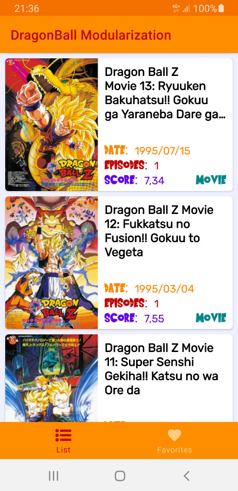
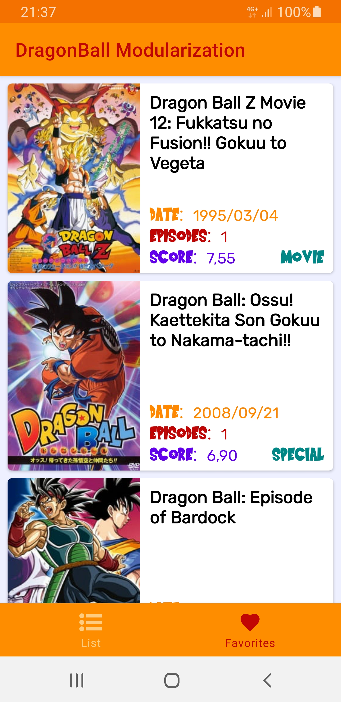
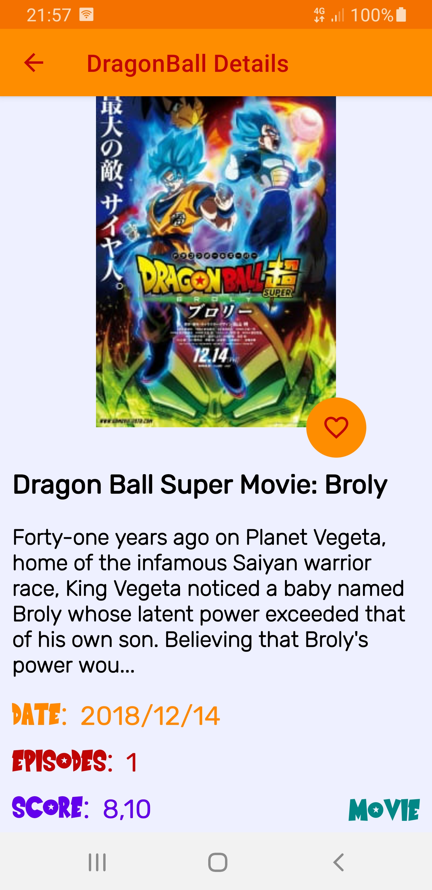

<h1 align="center">DragonBall Modularization</h1>

<p align="center">
  
</p>

<br />

## Introduction

DragonBall Modularization is a sample Android application focused on how to architect/configure a multi-module project. If you are looking for a beautiful design or complex architecture, sorry, this is not your repository. If you want to see many tests, great architecture, huge and complex database and much more, visit [Covid19Tracker repository](https://github.com/jaimegc/Covid19Tracker/).

## Technical summary

- [Offline-First](https://applikeysolutions.com/blog/the-offline-first-approach-to-mobile-app-development): The offline-first apps, while still requiring a connection to the servers, don't need a constant internet connection. The data from servers is downloaded to the user's device and can still be accessed offline.
- [Single Source of Truth (SSOT)](https://developer.android.com/jetpack/docs/guide#truth): It is the practice of structuring information models and associated schemata such that every data element is stored exactly once. You can have an offline app and be sure your data always use one source and that is your database.
- [Model-View-ViewModel (MVVM)](https://en.wikipedia.org/wiki/Model%E2%80%93view%E2%80%93viewmodel): It is a software architectural pattern that facilitates the separation of the development of the graphical user interface (without using [DataBinding](https://developer.android.com/topic/libraries/data-binding)). Also, there are [Screen States](/app/src/main/java/com/jaimegc/covid19tracker/ui/base/states/ScreenStates.kt) to handle the different states in the UI.
- [Android Architecture Components](https://developer.android.com/topic/libraries/architecture): Collection of libraries that help you design robust, testable, and maintainable apps.
  - [LiveData](https://developer.android.com/topic/libraries/architecture/livedata): Data objects that notify views when the underlying database changes.
  - [ViewModel](https://developer.android.com/topic/libraries/architecture/viewmodel): Stores UI-related data that isn't destroyed on UI changes. 
  - [ViewBinding](https://developer.android.com/topic/libraries/view-binding): Generates a binding class for each XML layout file present in that module and allows you to more easily write code that interacts with views.
  - [Room](https://developer.android.com/topic/libraries/architecture/room): The library provides an abstraction layer over SQLite to allow for more robust database access while harnessing the full power of SQLite.
  - [Navigation](https://developer.android.com/guide/navigation): This component helps you implement navigation.
- [Flow](https://kotlin.github.io/kotlinx.coroutines/kotlinx-coroutines-core/kotlinx.coroutines.flow/-flow/): A cold asynchronous data stream that sequentially emits values and completes normally or with an exception.
- [StateFlow](https://kotlin.github.io/kotlinx.coroutines/kotlinx-coroutines-core/kotlinx.coroutines.flow/-state-flow/): A SharedFlow that represents a read-only state with a single updatable data value that emits updates to the value to its collectors. A state flow is a hot flow because its active instance exists independently of the presence of collectors.
- [Kotlin Gradle DSL](https://docs.gradle.org/current/userguide/kotlin_dsl.html): Gradle's Kotlin DSL provides an alternative syntax to the traditional Groovy DSL with an enhanced editing experience in supported IDEs, with superior content assist, refactoring, documentation, and more.
- [Moshi](https://github.com/square/moshi): A modern JSON library for Kotlin and Java. The converter uses Moshi for serialization to and from JSON.

## Screens

### Home

<b>List & Favorites</b>

<p align="left">
  
  
</p>

### Details

<b>Activity (from List screen) & Fragment (from Favorites screen)</b>

<p align="left">
  
  
</p>

## Credits

### Special thanks

- [Jeroen Mols](https://twitter.com/molsjeroen) for the inspiration to start this project. His articles about modularization are amazing.
  - [Modularization Example](https://github.com/JeroenMols/ModularizationExample) is the modularization approach of this project.
  - [Blog (5 parts)](https://jeroenmols.com/blog/2019/03/06/modularizationwhy/) I have copied many paragraphs of these articles for this README.
- [Valorant-Agent Project](https://github.com/AhmedVargos/Valorant-Agents) for being the base of this project. The base code is the same but using a new modularization approach, API, design, navigation components, etc. <b>Also, if you want to see how to add tests in a multi-module project, this is your repository!</b>
- [Jikan Apiary](https://jikan.docs.apiary.io/) for the open-source API. DragonBall is always welcome :)

### Thanks

- Code:
  * [Rick & Morty App](https://github.com/kuuuurt/rick-and-morty-app)
  * [Android Modular Architecture](https://github.com/VMadalin/android-modular-architecture)
- Articles:
  * [Using the Navigation Component in a Modular World](https://medium.com/swlh/using-the-navigation-component-in-a-modular-world-e7578825962)
  * [7+1 tips about Android App Modularization](https://speakerdeck.com/prof18/7-plus-1-tips-about-android-app-modularization-droidcon-americas)
  * [Build a Modular Android App Architecture](https://proandroiddev.com/build-a-modular-android-app-architecture-25342d99de82)
  * [Patchwork Plaid — A modularization story](https://medium.com/androiddevelopers/a-patchwork-plaid-monolith-to-modularized-app-60235d9f212e)
- Icons & Images:
  * [Launcher & Splash](https://toppng.com/toyotaro-continuar%C3%A1-la-historia-de-dragon-ball-super-dragon-ball-super-PNG-free-PNG-Images_231124)
  * [Jeroen Mols Blog](https://jeroenmols.com/blog/2019/03/18/modularizationarchitecture/)
  * [Marco Gomiero Slides](https://speakerdeck.com/prof18/7-plus-1-tips-about-android-app-modularization-droidcon-americas)

## Contribute

If you want to contribute to this app, you're always welcome!
See [Contributing Guidelines](CONTRIBUTING.md). 

You can improve the code, adding screenshot tests, themes, compose, modularization, etc.

## Author

<table>
  <tr>
    <th height="50">Jaime GC</th>
    <th align="center"><a href="https://es.linkedin.com/in/jaimeguerrerocubero"></a></th>  
  </tr>
</table>

## License

```license
Copyright 2021 Jaime GC

Licensed under the Apache License, Version 2.0 (the "License");
you may not use this file except in compliance with the License.
You may obtain a copy of the License at

    http://www.apache.org/licenses/LICENSE-2.0

Unless required by applicable law or agreed to in writing, software
distributed under the License is distributed on an "AS IS" BASIS,
WITHOUT WARRANTIES OR CONDITIONS OF ANY KIND, either express or implied.
See the License for the specific language governing permissions and
limitations under the License.
```
