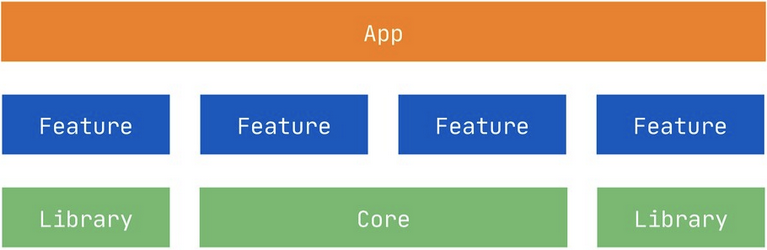
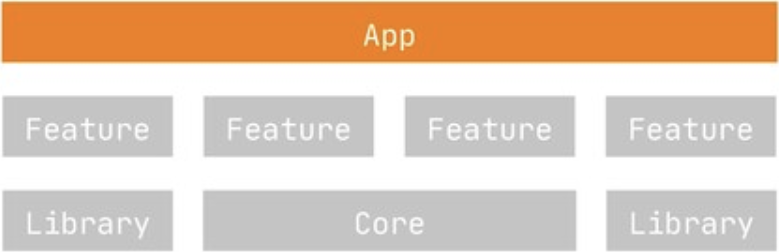
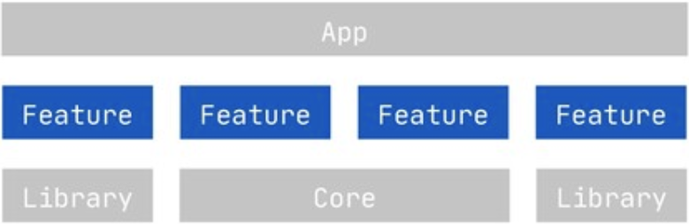
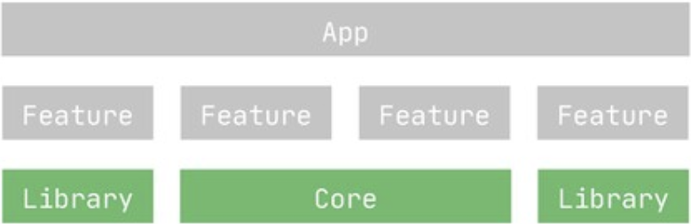
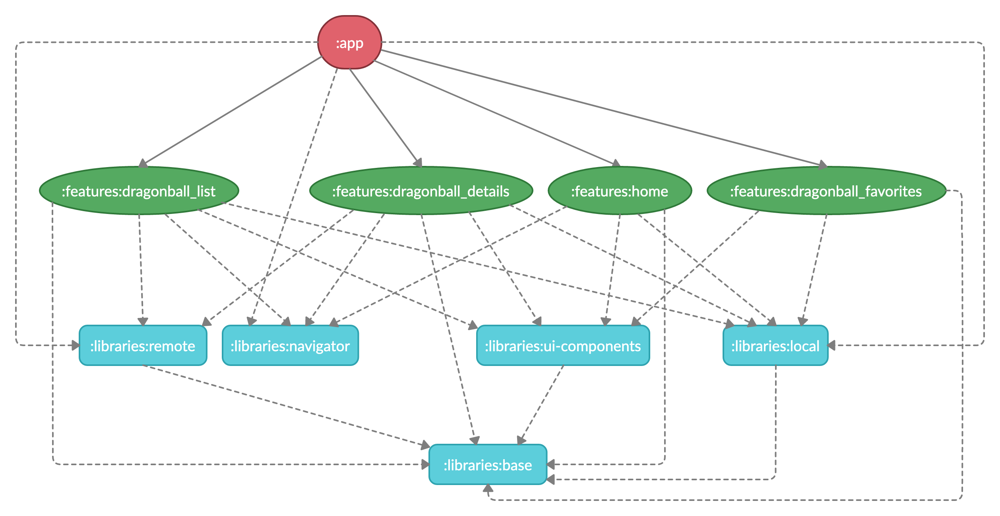
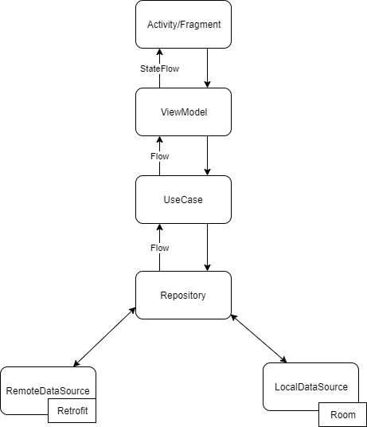

<h1 align="center">DragonBall Modularization </h1>

<p align="center">
  
</p>

<br />

## Introduction

DragonBall Modularization is a sample Android application focused on how to architect/configure a multi-module project. If you are looking for a beautiful design or complex architecture, sorry, this is not your repository. If you want to see a lot of tests, great architecture, github actions, huge and complex database and much more, visit my [Covid19Tracker repository](https://github.com/jaimegc/Covid19Tracker/).

## Technical summary

- [Multi-Module](https://jeroenmols.com/blog/2019/03/06/modularizationwhy/): Modularization is incredibly powerful to speed up your builds, simplify development and fundamentally scale your team. On top of that, it enables interesting use cases such as instant apps and makes it easier to experiment with new technologies.
- [Offline-First](https://applikeysolutions.com/blog/the-offline-first-approach-to-mobile-app-development): The offline-first apps, while still requiring a connection to the servers, don't need a constant internet connection. The data from servers is downloaded to the user's device and can still be accessed offline.
- [Single Source of Truth (SSOT)](https://developer.android.com/jetpack/docs/guide#truth): It is the practice of structuring information models and associated schemata such that every data element is stored exactly once. You can have an offline app and be sure your data always use one source and that is your database.
- [Model-View-ViewModel (MVVM)](https://en.wikipedia.org/wiki/Model%E2%80%93view%E2%80%93viewmodel): It is a software architectural pattern that facilitates the separation of the development of the graphical user interface (without using [DataBinding](https://developer.android.com/topic/libraries/data-binding)). Also, there are [Screen States](/app/src/main/java/com/jaimegc/covid19tracker/ui/base/states/ScreenStates.kt) to handle the different states in the UI.
- [Android Architecture Components](https://developer.android.com/topic/libraries/architecture): Collection of libraries that help you design robust, testable, and maintainable apps.
  - [LiveData](https://developer.android.com/topic/libraries/architecture/livedata): Data objects that notify views when the underlying database changes.
  - [ViewModel](https://developer.android.com/topic/libraries/architecture/viewmodel): Stores UI-related data that isn't destroyed on UI changes. 
  - [ViewBinding](https://developer.android.com/topic/libraries/view-binding): Generates a binding class for each XML layout file present in that module and allows you to more easily write code that interacts with views.
  - [Room](https://developer.android.com/topic/libraries/architecture/room): The library provides an abstraction layer over SQLite to allow for more robust database access while harnessing the full power of SQLite.
  - [Navigation](https://developer.android.com/guide/navigation): This component helps you implement navigation.
- [Flow](https://kotlin.github.io/kotlinx.coroutines/kotlinx-coroutines-core/kotlinx.coroutines.flow/-flow/): A cold asynchronous data stream that sequentially emits values and completes normally or with an exception.
- [StateFlow](https://kotlin.github.io/kotlinx.coroutines/kotlinx-coroutines-core/kotlinx.coroutines.flow/-state-flow/): A SharedFlow that represents a read-only state with a single updatable data value that emits updates to the value to its collectors. A state flow is a hot flow because its active instance exists independently of the presence of collectors.
- [Kotlin Gradle DSL](https://docs.gradle.org/current/userguide/kotlin_dsl.html): Gradle's Kotlin DSL provides an alternative syntax to the traditional Groovy DSL with an enhanced editing experience in supported IDEs, with superior content assist, refactoring, documentation, and more.
- [Koin](https://start.insert-koin.io/): Dependency Injection Framework (Kotlin).
- [Moshi](https://github.com/square/moshi): A modern JSON library for Kotlin and Java. The converter uses Moshi for serialization to and from JSON.

## Screens

### Home

<b>List & Favorites</b>

<p align="left">
  
  
</p>

### Details

<b>Activity (from List screen) & Fragment (from Favorites screen)</b>

<p align="left">
  
  
</p>

## Modularization: A bit of [theory](https://jeroenmols.com/blog/2019/03/06/modularizationwhy/)

### Why 

- <b>Speeds up builds</b>. Gradle does two things to speed up builds: Cache work it did before so it doesn’t have to do it again. Try to do as much work as possible in parallel.
- <b>Enable on demand delivery</b>. [On demand delivery](https://developer.android.com/studio/projects/dynamic-delivery) allows to ship a smaller app with fewer features and download new features on the fly when the user starts accessing those. [Instant apps](https://developer.android.com/topic/google-play-instant/) allow users to run apps without installing them.
- <b>Simplify development</b>. In a modularized world you could still have spaghetti (within modules), but at least it would be multiple smaller, easily digestible portions.
- <b>Reuse modules across apps</b>. Should your business be successful, you have a head start launching a second app/product!, maybe someday you want to involve 3rd party developers on your platform and make an SDK, etc.
- <b>Experiment with new technologies</b>. What if you just contain the new tech/architecture to a single module? That makes integrating the technology a lot easier and you can experience the full benefits of the technology by converting an entire module end to end.
- <b>Scale development teams</b>. if you split your app in a smart way, you can delegate the ownership of particular feature modules to particular teams/people. Completely avoiding concurrent modifications, or at least limiting those problems to a smaller set of modules.
- <b>Enables refactoring</b>. You want to refactor or rebuilt all functionality behind a feature toggle, so you can first verify that everything works (at least on par) before rolling it out to everyone. Risk reduction like this is key. With the right split you can at least solve this problem for some use cases.
- <b>Simplifies test automation</b>. It can enable the flow to be tested without having to step through other parts of the app. This speeds up tests, simplifies test setup and increases their reliability.

### Modularized Architecture

<p align="left">
  
</p>

This architecture basically splits an app into three levels of modules:
  - App: links together features modules (usually only one).
  - Features: self-contained, full-screen UI level features that include Espresso tests. Feature modules <b>never</b> directly depend on each other.
  - Libraries: functionality shared across multiple features. Different libraries can depend on each other.

### App Module

<p align="left">
  
</p>

App module orchestrates the navigation from between features. It uses feature toggles to determine what should be enabled and what not.
  - Android application.
  - Link all the modules together.
  - Depends on other features and libraries.

### Feature Modules

<p align="left">
  
</p>

Probably the most important modules are feature modules. These have the following characteristics:
  - Android library module.
  - Respond to implicit intents and pass back a result.
  - Never depend on other features or app.
  - depend on several library modules.

### Library Modules

<p align="left">
  
</p>

Libraries provide shared plumbing that is reused across several or all features. Their characteristics are:
  - Android library, pure Java or Kotlin module.
  - Never depend on features or app.
  - Can (but don't have to) depend on other libraries.

### Navigation

The first key benefit is that feature modules make navigation within an app significantly easier. This is because they split the navigation problem into smaller parts:
  - Navigation within a feature -> handled by the feature itself.
  - Navigation between features -> handled by the app module.

### Scaling

Making features independent like this completely decouples their implementations. Hence eliminating merge conflicts across different feature teams by design! Experimenting with new technologies also becomes a lot easier: you can easily benefit from new tech end to end within a single feature.

### Testing

Because all features can be started directly using an intent, there is no need for Espresso to step through other parts of the app to arrive at the feature to test. This not only makes tests simpler and faster, but fewer steps also make them more reliable and tests can no longer break due to bugs in other features!

## DragonBall Modularization 

### Modularized Architecture

<p align="left">
  
</p>

Summarizing, <b>app module</b> launches the <b>:features:home</b> using the <i>NavigationActions</i> object from the <b>:libraries:navigator</b>.

```kotlin
// app module
class MainActivity : AppCompatActivity() {
    override fun onCreate(savedInstanceState: Bundle?) {
        ...
        startActivity(NavigationActions.navigateToHomeScreen(this@MainActivity))
    }
}

// :libraries:navigator module
object NavigationActions {
    fun navigateToHomeScreen(context: Context, noAnimation: Boolean = true): Intent =
        internalIntent(context, "com.dragonballmodularization.features.home.navigate", noAnimation).also {
            navigate(context, it)
        }
    }
    ...
}    
```

```xml
<!-- :features:home Manifest.xml -->
<manifest xmlns:android="http://schemas.android.com/apk/res/android"
    package="com.jaimegc.dragonballmodularization.features.home">
    <application>
        <activity
            android:name=".presentation.HomeActivity"
            ...>
            <intent-filter>
                <action android:name="com.dragonballmodularization.features.home.navigate"/>
                <category android:name="android.intent.category.DEFAULT" />
            </intent-filter>
        </activity>
    </application>
</manifest>
```

Also, <b>:features:home</b> has three navigation graphs:

Base screen.
```xml
<navigation 
    ...        
    app:startDestination="@id/home_fragment">
    <fragment
        android:id="@+id/home_fragment"
        android:name="com.jaimegc.dragonballmodularization.features.home.presentation.HomeFragment"
        android:label="HomeFragment">
    </fragment>
</navigation>
```

BottomNavigationView has two navigation graphs:
```xml
<!-- List Tab -->
<navigation
    ...        
    android:id="@+id/navigation_dragonball_list_graph"
    app:startDestination="@+id/dragonball_list_fragment">
    <fragment
        android:id="@+id/dragonball_list_fragment"
        android:name="com.jaimegc.dragonballmodularization.features.dragonball_list.presentation.DragonBallListFragment"
        android:label="List" />
</navigation>

<!-- Favorites Tab -->
<navigation 
    ...
    android:id="@+id/navigation_dragonball_favorites_graph"
    app:startDestination="@+id/dragonball_favorites_fragment">
    <fragment
        android:id="@+id/dragonball_favorites_fragment"
        android:name="com.jaimegc.dragonballmodularization.features.dragonball_favorites.presentation.FavoriteDragonBallFragment"
        android:label="Favorites">
        <action
            android:id="@+id/action_dragonBallListFragment_to_dragonBall_detail_fragment"
            app:destination="@+id/dragonball_details_fragment"
            .../>
    </fragment>
    <fragment
        android:id="@+id/dragonball_details_fragment"
        android:name="com.jaimegc.dragonballmodularization.features.dragonball_details.presentation.DragonBallDetailsFragment">
        <argument
            android:name="dragonball_id"
            app:argType="long" />
        <deepLink
            app:uri="dragonBall://dragonball_details/{dragonball_id}" />
    </fragment>
</navigation>
```

<b>FavoriteDragonBallFragment</b> and <b>DragonBallDetailsFragment</b> classes will be in highlighted red. This is due to both fragments are in other modules. There is no problem because the project will compile correctly. You can see this [issue](https://github.com/android/architecture-components-samples/issues/663) for more information.

Finally, there are two details screens. From list to details screen is an Activity and from favorites screen is a Fragment.

In the first case, we use <i>NavigationActions</i>:

```kotlin
// :libraries:navigator module
object NavigationActions {
    ...
    fun navigateToDragonBallDetailsScreen(context: Context, dragonBallId: Long, noAnimation: Boolean = true): Intent =
        internalIntent(context, "com.dragonballmodularization.features.dragonball_details.navigate", noAnimation)
            .apply { putExtra(DRAGONBALL_ID_KEY, dragonBallId) }
            .also {
                navigate(context, it)
            }
     ...       
}
```

```xml
<!-- :features:dragonball_details Manifest.xml -->
<manifest xmlns:android="http://schemas.android.com/apk/res/android"
    package="com.jaimegc.dragonballmodularization.features.dragonball_details">
    <application>
        <activity
            android:name=".presentation.DragonBallDetailsActivity"
            ...>
            <intent-filter>
                <action android:name="com.dragonballmodularization.features.dragonball_details.navigate"/>
                <category android:name="android.intent.category.DEFAULT" />
            </intent-filter>
        </activity>
    </application>
</manifest>
```

In the second one, we use the <i>deepLink</i> declared in the previous navigation graph:

```kotlin
dragonBallCellViewModel.openDragonBallDetails.observe(this) {
    findNavController().navigateUriWithDefaultOptions(
        Uri.parse("dragonBall://dragonball_details/${it.id}"),
    )
}
```

### Architecture Diagram

<p align="left">
  
</p>

## Credits

### Special thanks

- [Jeroen Mols](https://twitter.com/molsjeroen) for the inspiration to start this project. His articles about modularization are amazing.
  - [Modularization Example](https://github.com/JeroenMols/ModularizationExample) is the modularization approach of this project.
  - [Blog (5 parts)](https://jeroenmols.com/blog/2019/03/06/modularizationwhy/) I have copied many paragraphs of these articles for this README.
- [Valorant-Agent Project](https://github.com/AhmedVargos/Valorant-Agents) for being the base of this project. The base code is the same but using a new modularization approach, API, design, navigation components, etc. <b>Also, if you want to see how to add tests in a multi-module project, this is your repository!</b>
- [Jikan Apiary](https://jikan.docs.apiary.io/) for the open-source API. DragonBall is always welcome :)

### Thanks

- Code:
  * [Rick & Morty App](https://github.com/kuuuurt/rick-and-morty-app)
  * [Android Modular Architecture](https://github.com/VMadalin/android-modular-architecture)
- Articles:
  * [Using the Navigation Component in a Modular World](https://medium.com/swlh/using-the-navigation-component-in-a-modular-world-e7578825962)
  * [7+1 tips about Android App Modularization](https://speakerdeck.com/prof18/7-plus-1-tips-about-android-app-modularization-droidcon-americas)
  * [Build a Modular Android App Architecture](https://proandroiddev.com/build-a-modular-android-app-architecture-25342d99de82)
  * [Patchwork Plaid — A modularization story](https://medium.com/androiddevelopers/a-patchwork-plaid-monolith-to-modularized-app-60235d9f212e)
- Icons & Images:
  * [Launcher & Splash](https://toppng.com/toyotaro-continuar%C3%A1-la-historia-de-dragon-ball-super-dragon-ball-super-PNG-free-PNG-Images_231124)
  * [Jeroen Mols Blog](https://jeroenmols.com/blog/2019/03/18/modularizationarchitecture/)
  * [Architecture Diagram](https://github.com/AhmedVargos/Valorant-Agents/blob/master/screenshots/arch_diagram.jpg)
  * [Marco Gomiero Slides](https://speakerdeck.com/prof18/7-plus-1-tips-about-android-app-modularization-droidcon-americas)

## Contribute

If you want to contribute to this app, you're always welcome!
See [Contributing Guidelines](CONTRIBUTING.md). 

You can improve the code, adding tests, themes, compose, etc.

## Author

<table>
  <tr>
    <th height="50">Jaime GC</th>
    <th align="center"><a href="https://es.linkedin.com/in/jaimeguerrerocubero"></a></th>  
  </tr>
</table>

## License

```license
Copyright 2021 Jaime GC

Licensed under the Apache License, Version 2.0 (the "License");
you may not use this file except in compliance with the License.
You may obtain a copy of the License at

    http://www.apache.org/licenses/LICENSE-2.0

Unless required by applicable law or agreed to in writing, software
distributed under the License is distributed on an "AS IS" BASIS,
WITHOUT WARRANTIES OR CONDITIONS OF ANY KIND, either express or implied.
See the License for the specific language governing permissions and
limitations under the License.
```
